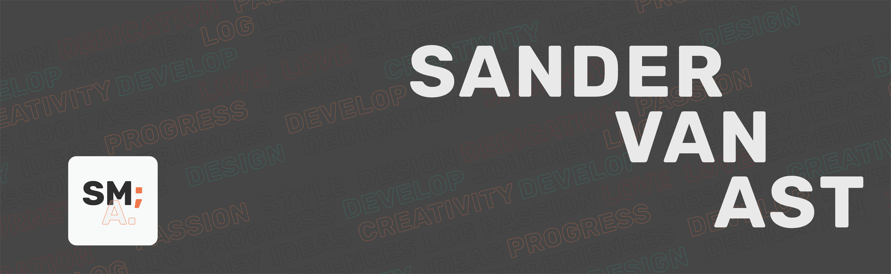

## Hey There! ,

I'm **Sander van Ast** A.K.A **[@SANDR7]**, a 18 year old enthousiast programmer👨‍💻 based in The Netherlands🇳🇱. My passion lies in web development and mobile development. I'm also a strong interest in graphic design and UI & UX development.

- 🌱 I’m currently learning MERN Stack.
- 💬 Ask me about: anything but anime or weeb stuff
- ⚡ Languages: JavaScript, C#, Scss

## 🔧 Technologies & Tools

## 🏓 Get In Touch On ...

## 📈 Github Stats ...

  

> "Developing the web by Creating for other people."

---

~ From [Sander van Ast](https://github.com/SANDR7)